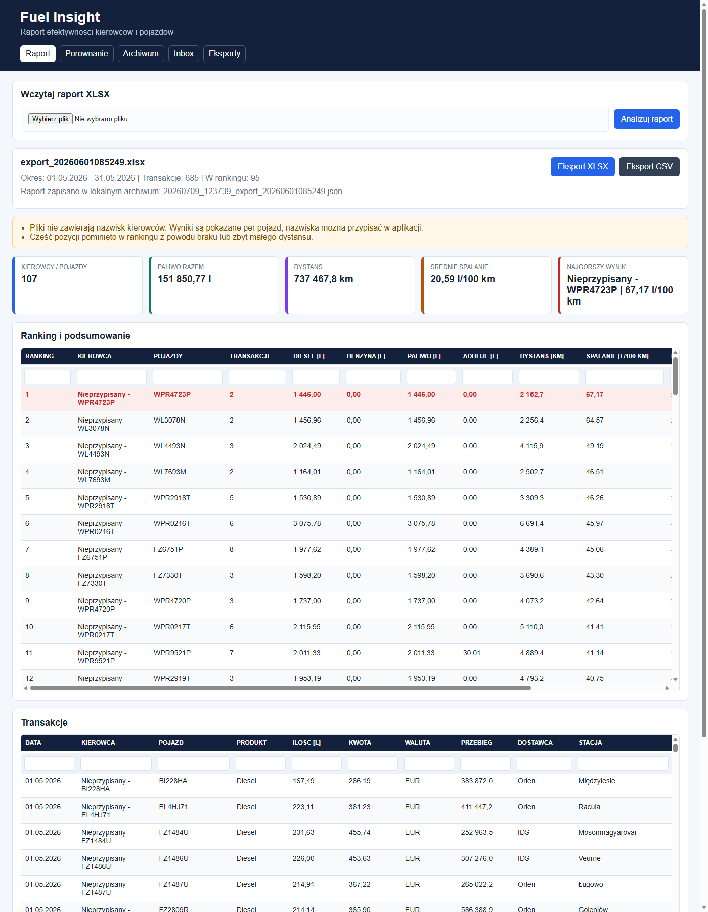
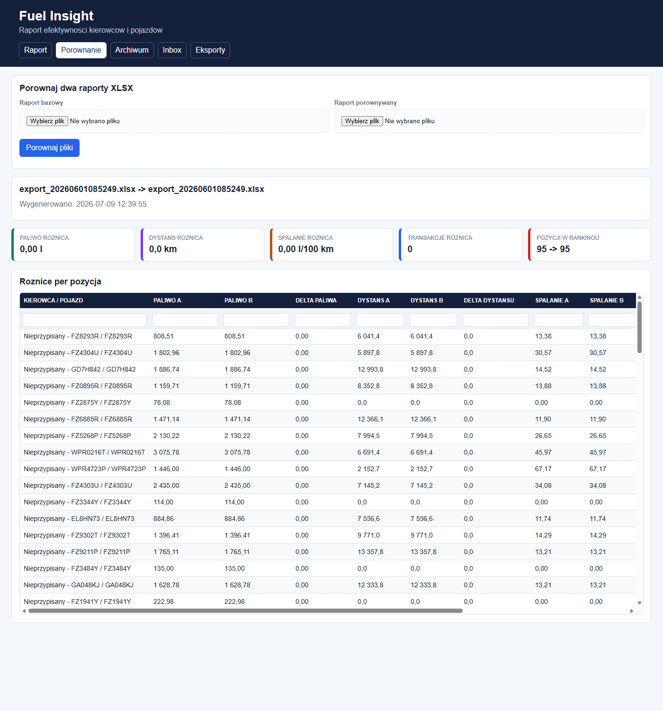
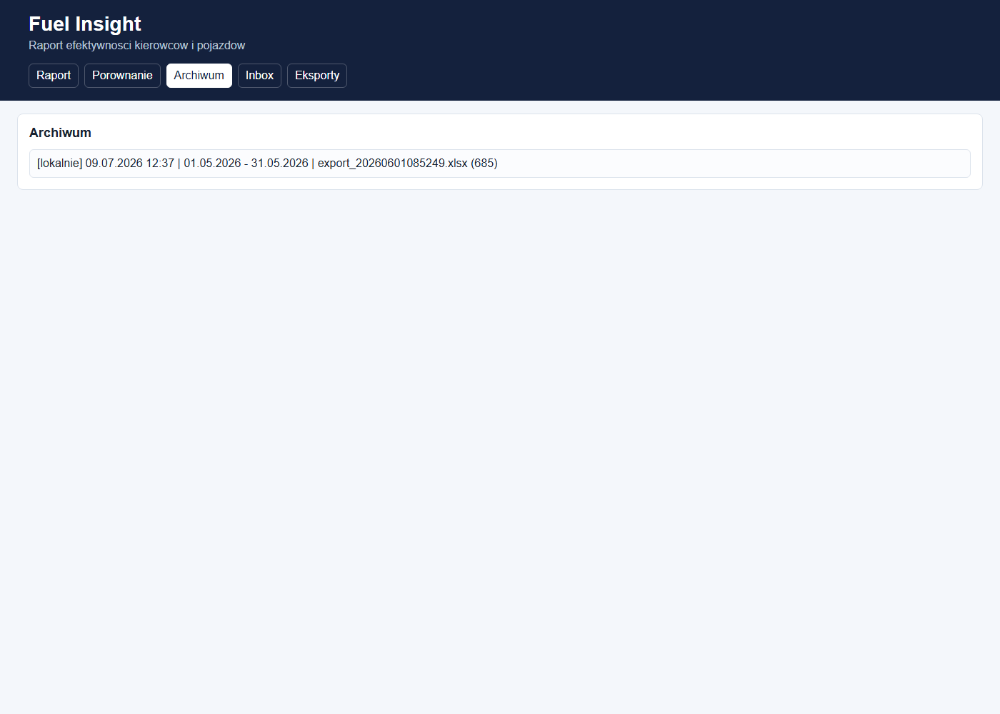
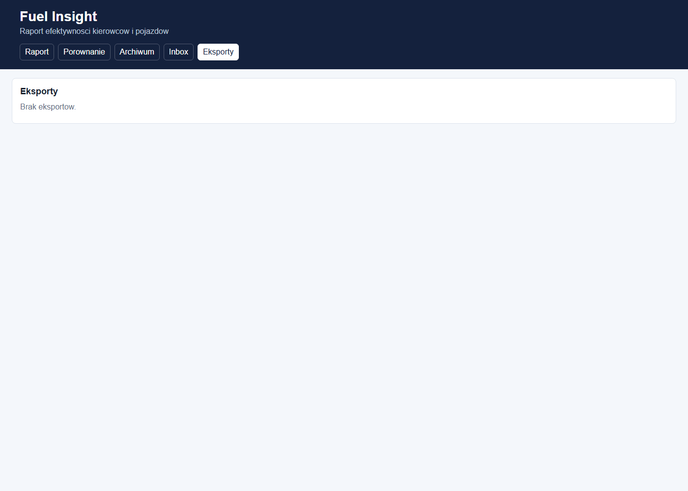
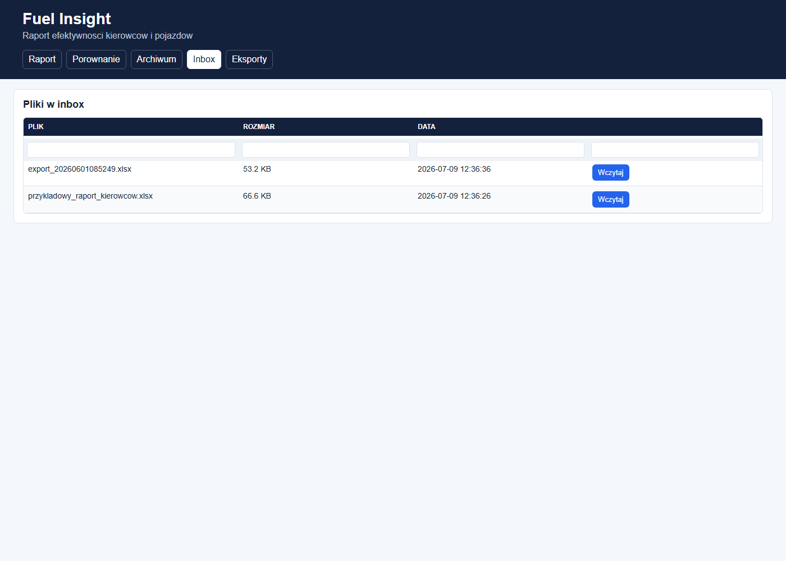

# Fuel Insight - instrukcja obsługi dla pracownika

Ta instrukcja pokazuje, jak korzystać z panelu Fuel Insight: wczytać raport paliwowy, sprawdzić ranking, filtrować tabele, porównać dwa pliki oraz pobrać gotowy eksport.

Nie musisz instalować programu na swoim komputerze. Wystarczy przeglądarka internetowa i adres panelu, który otrzymasz od administratora, np.:

```text
http://adres-serwera:8000
```

## 1. Ekran główny

Po wejściu na stronę zobaczysz górne menu:

- **Raport** - wczytanie pliku i przegląd aktualnego raportu.
- **Porównanie** - porównanie dwóch plików XLSX.
- **Archiwum** - wcześniej zapisane raporty.
- **Inbox** - pliki wrzucone na serwer do katalogu wejściowego.
- **Eksporty** - gotowe pliki XLSX/CSV do pobrania.



## 2. Wczytanie raportu XLSX

1. Wejdź w zakładkę **Raport**.
2. W sekcji **Wczytaj raport XLSX** kliknij pole wyboru pliku.
3. Wybierz raport XLSX z systemu kart paliwowych.
4. Kliknij **Wczytaj**.
5. Poczekaj, aż strona pokaże komunikat, że raport został wczytany i przeliczony.

Po poprawnym wczytaniu zobaczysz:

- kafelki z podsumowaniem, np. paliwo, AdBlue, dystans, średnie spalanie,
- ranking kierowców lub pojazdów,
- listę transakcji z raportu.

Przy dużych plikach przeliczenie może potrwać dłużej. W tym czasie nie zamykaj karty przeglądarki.

## 3. Jak czytać ranking

Tabela **Ranking i podsumowanie** pokazuje wyniki po kierowcach lub pojazdach.

Najważniejsze kolumny:

- **Pozycja** - miejsce w rankingu.
- **Kierowca / pojazdy** - osoba lub pojazdy z raportu.
- **Paliwo [l]** - suma paliwa.
- **AdBlue [l]** - suma AdBlue, jeśli występuje.
- **Dystans [km]** - dystans wyliczony z przebiegów.
- **Spalanie [l/100 km]** - najważniejszy wynik do oceny.
- **Status** - informacja, czy wynik jest liczony w rankingu.

Wiersz oznaczony jako najgorszy wynik jest wyróżniony kolorem.

## 4. Filtrowanie i sortowanie tabel

W tabelach, np. **Ranking i podsumowanie** oraz **Transakcje**, możesz szybko znaleźć potrzebne dane:

- wpisz tekst w pole pod nazwą kolumny, aby przefiltrować wiersze,
- kliknij nagłówek kolumny, aby posortować wyniki,
- kliknij ten sam nagłówek ponownie, aby odwrócić kolejność sortowania.

Przykłady:

- wpisz numer rejestracyjny w filtrze kolumny **Pojazd**,
- wpisz nazwisko w filtrze kolumny **Kierowca**,
- kliknij **Spalanie [l/100 km]**, aby zobaczyć najlepsze albo najgorsze wyniki,
- kliknij **Data**, aby ułożyć transakcje chronologicznie.

## 5. Transakcje

Sekcja **Transakcje** pokazuje szczegóły z pliku źródłowego.

Najczęściej sprawdzane kolumny:

- **Data** - data tankowania lub transakcji.
- **Kierowca** - kierowca przypisany do pojazdu.
- **Pojazd** - numer rejestracyjny.
- **Produkt** - np. Diesel, Benzyna, AdBlue.
- **Ilość [l]** - liczba litrów.
- **Kwota** i **Waluta** - wartość transakcji.
- **Przebieg** - przebieg z danych.
- **Dostawca** i **Stacja** - miejsce lub operator transakcji.

## 6. Porównanie dwóch raportów

Zakładka **Porównanie** służy do sprawdzenia różnic między dwoma plikami, np. z dwóch okresów albo dwóch wersji raportu.



1. Wejdź w zakładkę **Porównanie**.
2. Wybierz pierwszy plik w polu **Raport A**.
3. Wybierz drugi plik w polu **Raport B**.
4. Kliknij **Porównaj**.
5. Sprawdź kafelki z różnicami oraz tabelę **Różnice per pozycja**.

W tabeli porównania:

- dodatnie delty oznaczają wzrost względem pierwszego raportu,
- ujemne delty oznaczają spadek,
- filtry i sortowanie działają tak samo jak w raporcie.

## 7. Archiwum

Każdy poprawnie wczytany raport jest zapisywany w archiwum.



1. Wejdź w zakładkę **Archiwum**.
2. Kliknij wybrany zapisany raport.
3. Panel załaduje go ponownie jako aktualny raport.

Użyj archiwum, gdy chcesz wrócić do wcześniejszej analizy bez ponownego wgrywania pliku.

## 8. Eksporty

Zakładka **Eksporty** zawiera gotowe pliki wynikowe do pobrania.



1. Wejdź w zakładkę **Eksporty**.
2. Znajdź potrzebny plik.
3. Kliknij **Pobierz**.

Eksport XLSX zawiera zwykle arkusze z podsumowaniem, transakcjami i mapowaniem kierowców. Jeśli włączony jest eksport CSV, obok może pojawić się również plik CSV.

## 9. Inbox

Zakładka **Inbox** pokazuje pliki, które znajdują się w katalogu wejściowym na serwerze.



Możesz jej użyć, gdy administrator albo inny proces wrzuca pliki bezpośrednio na serwer.

1. Wejdź w zakładkę **Inbox**.
2. Znajdź plik na liście.
3. Kliknij **Wczytaj** przy wybranym pliku.
4. Po chwili raport pojawi się w zakładce **Raport**.

## 10. Co zrobić, gdy pojawi się błąd

Najczęstsze sytuacje:

- **Brak wymaganych kolumn** - wybrany plik nie jest prawidłowym eksportem dla tej aplikacji. Wybierz właściwy raport XLSX.
- **Plik jest za duży** - plik przekracza limit ustawiony na serwerze. Skontaktuj się z administratorem.
- **Nie znaleziono pliku w inbox** - plik został usunięty albo przeniesiony. Odśwież listę.
- **Brak wyników w rankingu** - raport mógł nie mieć przebiegów albo dystans był zbyt mały do policzenia spalania.

## 11. Dobre praktyki

- Wgrywaj tylko pliki XLSX z zaufanego źródła.
- Po wczytaniu sprawdź komunikat u góry strony.
- Przy dużych plikach poczekaj spokojnie, przeliczenie może potrwać.
- Do szukania konkretnego pojazdu używaj filtrów pod nagłówkami tabel.
- Po zakończeniu pracy pobierz eksport z zakładki **Eksporty**, jeśli potrzebujesz pliku do dalszej wysyłki.